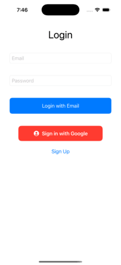

# Track My Day

**Track My Day** is a user-centric task management app designed to simplify organizing, tracking, and managing daily tasks. With a sleek interface, location-based task tracking, weather integration, and robust data storage powered by Firebase, this app empowers users to stay productive and achieve their goals effortlessly.

---

## Features

- **Task Management**: Create, update, and delete tasks with intuitive controls.
- **Location-Based Integration**: Add location-specific tasks and view them on an interactive map.
- **Weather Updates**: Get real-time weather information for task locations.
- **Firebase Data Storage**: All tasks are securely stored and synced using Firebase Firestore.
- **User Authentication**: Login and signup support with email and Google integration.
- **Categories & Organization**: Classify tasks as Personal, Work, School, or Other for better organization.
- **User-Friendly Interface**: Designed for seamless usability and accessibility.

---

## Screenshots

### Login Screen


### Task List Screen


### Add Task Screen


### Task Details Screen

---

## Installation

1. Clone the repository:
   ```bash
   git clone https://github.com/your-username/track-my-day.git

Follow these steps to set up the project locally:

1. Navigate to the project directory:
   ```bash
   cd track-my-day

2. Install dependencies:
   ```bash
   pod install

3. Open the project in Xcode:
   ```bash
   open TrackMyDay.xcworkspace

4. Run the app on your simulator or connected device.

## Usage

1. **Launch the App**  
   Log in using your email or Google account.

2. **Add New Tasks**  
   Enter task details, including:
   - Task Name
   - Date
   - Time
   - Category (e.g., Personal, Work)
   - Location

3. **View Tasks**  
   - Tasks are displayed in categorized sections:
     - **To-Do**: Pending tasks.
     - **Completed**: Tasks marked as complete.

4. **Manage Tasks**  
   - Mark tasks as complete.
   - Delete tasks if no longer needed.

5. **Location-Based Management**  
   - Use the integrated map to view and manage tasks based on their location.

## Technology Stack

- **Frontend**: SwiftUI  
- **Backend**: Firebase Firestore  
- **Authentication**: Firebase Authentication  
- **Weather API**: WeatherAPI  
- **Architecture**: MVVM (Model-View-ViewModel)


